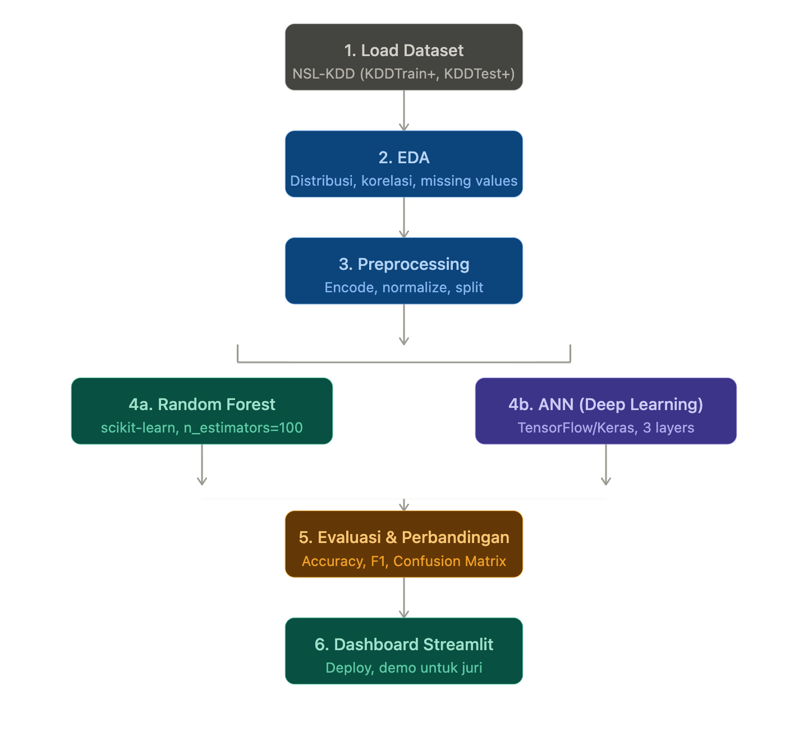
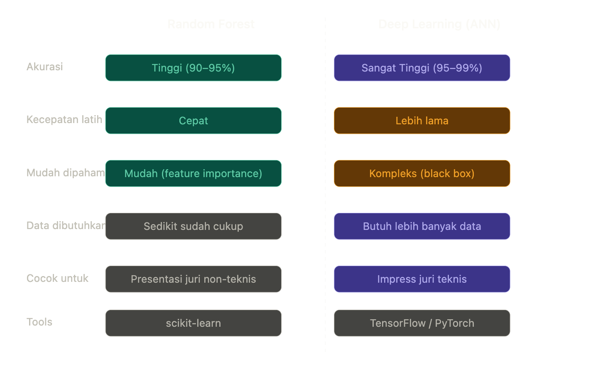

# Machine Learning Project

### Implementasi Sistem Deteksi Intrusi Jaringan Menggunakan Machine Learning untuk Klasifikasi Serangan Siber pada Server Linux

(Notebook + Dashboard Streamlit) karena:

*   **Notebook**: Dokumentasi proses untuk juri teknis.
*   **Streamlit**: Demo interaktif untuk presentasi, bisa diakses siapapun lewat browser.

### Project Workflow & UI

### Datasets
*   [NSL-KDD (Kaggle)](https://www.kaggle.com/datasets/hassan06/nslkdd)
*   [IoMT Dataset 2024 (UNB CIC)](https://www.unb.ca/cic/datasets/iomt-dataset-2024.html)
*   [UNB CIC Official](https://www.unb.ca/cic)
*   [UNSW-NB15 (Official Project)](https://research.unsw.edu.au/projects/unsw-nb15-dataset)
*   [UNSW-NB15 (Kaggle)](https://kaggle.com/datasets/mrwellsdavid/unsw-nb15)
